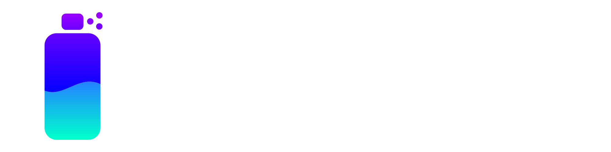

# CESCO

이사벨 고등학교의 프로그래밍 동아리 입니다.

## 활동

- HTML, CSS, JS를 이용해 웹 페이지를 만듭니다.
- Jekyll을 이용해 블로그를 만듭니다.

---

- React, Vue를 이용해 프론트엔드를 만듭니다.
- Python을 이용해 백엔드를 만듭니다.
- 직접 딥러닝 라이브러리를 구현합니다.
- 다양한 알고리즘 문제를들을 해결합니다.
